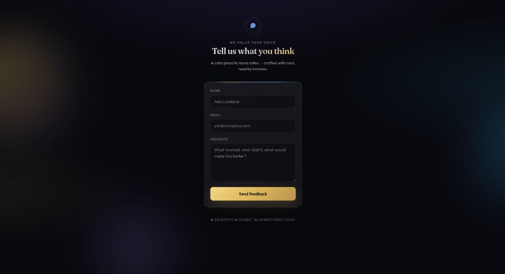

# Feedback form — Spectent internship assignment

A small full-stack **feedback form**: React (JavaScript) frontend and **Go + Gin** API. Feedback is stored **in memory** (no database), matching the brief.



## Live demo

Deploy the app with the included **Dockerfile** (one container serves the built SPA and the API on the same origin). Free options: [Render](https://render.com) (see `render.yaml`) or [Fly.io](https://fly.io) with the same image.

**After you deploy, paste your public URL here** (example shape: `https://spectent-feedback.onrender.com`).

Quick path on **Render**: New → **Web Service** → connect this GitHub repo → **Runtime: Docker** → leave defaults → Create. Render sets `PORT` automatically; the server reads it and serves the Vite build from `/` and `POST /feedback` on the same host.

## Purpose

Users submit **name**, **email**, and **feedback**. The API validates input and keeps submissions in a process-local list for the assignment demo.

## Tech

| Layer    | Stack                                      |
|----------|--------------------------------------------|
| Frontend | React 18, Vite, plain JS (no TypeScript)   |
| Backend  | Go 1.22+, Gin                              |
| Storage  | In-memory slice (lost on server restart)   |
| Deploy   | Multi-stage **Dockerfile** (Node build → Go binary + static) |

## Run locally

**Dev (hot reload + API proxy)**

**Terminal 1 — API**

```bash
cd server
go run .
```

Server listens on **http://127.0.0.1:8080** — `POST /feedback` only, unless you add a static build (below).

**Terminal 2 — UI**

```bash
cd frontend
npm install
npm run dev
```

Open the URL Vite prints (usually **http://127.0.0.1:5173**). The dev server proxies `/feedback` to the Go API.

**Single process (like production):** build the SPA into `server/static`, then run Go — the UI and API share **http://127.0.0.1:8080**.

```bash
cd frontend && npm install && npm run build && rm -rf ../server/static && cp -r dist ../server/static
cd ../server && go run .
```

**Docker (matches cloud deploy)**

```bash
docker build -t spectent-feedback .
docker run --rm -p 8080:8080 spectent-feedback
```

Open **http://127.0.0.1:8080**.

## API

`POST /feedback` — JSON body:

```json
{ "name": "string", "email": "string", "feedback": "string" }
```

Success: `201` with `{ "ok": true, "message": "..." }`.  
Validation or bad JSON: `400` with `{ "ok": false, "error": "..." }`.

## Assignment write-up

See **[DOCUMENT.md](./DOCUMENT.md)** for failure modes, fixes, design notes, and optional scale thoughts.
